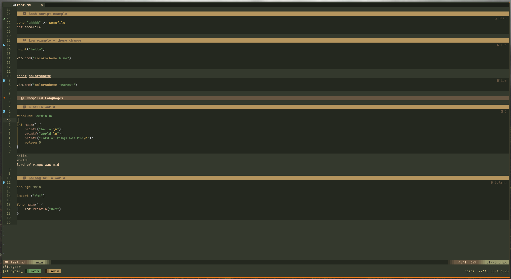
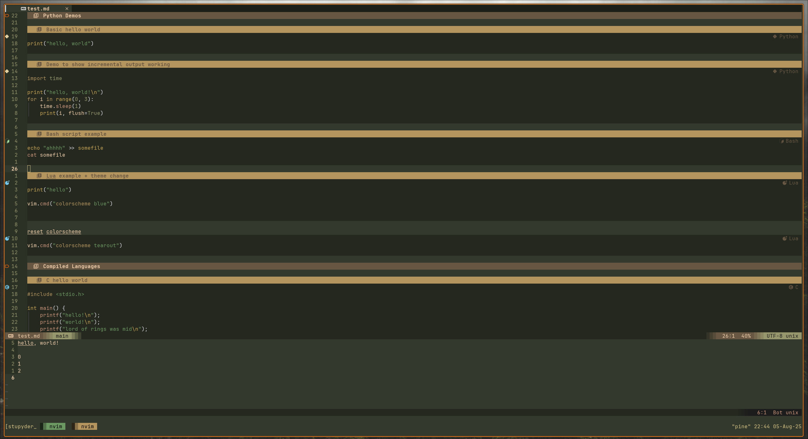
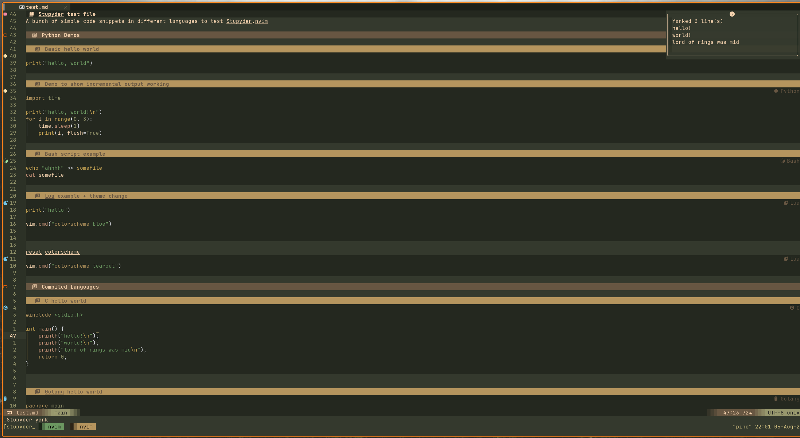

# Stupyder.nvim

This is still a WIP but is functional (no promises) and has most features implemented. I'm working on making the config less wonky, adding more default tool options, and a couple of QoL improvements.

**If you encounter an issue**: ~~keep it to yourself~~ Please open a ticket, I'll fix it asap!


Simple markdown code block executor. Stupyder acts as a simple frontend: it passes code block content to a corresponding tool and returns the result, displaying it in a window, as virtual text, or by yanking it to a register. A tool’s configuration can include multiple steps, such as compiling and then running code snippets.


https://github.com/user-attachments/assets/07dda535-2949-4cb0-a83d-81099feeeb17


## Why

I've got a couple of niche problems I thought this could solve. Also, it was a good excuse to learn more of the Neovim API. 

**Niche problems**:
* Running README.md example commands/snippets without leaving the README (useful for updating documentation output).
* I write all my notes in markdown files in Neovim, and being able to run snippets/commands in my notes is neat.
* With (self-plug) [brr.nvim](https://github.com/leobeosab), I use it as a REPL in my scratch pad, which saves time if I don't want to run a whole test or project.
  * Or with any other markdown scratch pad like the one in [snacks.nvim](https://github.com/folke/snacks.nvim)


## Installation and config

Install with Lazy!

```lua
return {
  dir = "~/proj/stupyder.nvim/",
  cmd = { "Stupyder" },
  config = function ()
    require("stupyder").setup({
      run_options = { print_debug_info = false },
      modes = {
        win = {
          close_shortcut = "q"
        },
        yank = {
          --default
          register = '*'

          --unnamed clipboard
          --register = '"'

          --unnamedplus clipboard
          --register = '+'
        }
      }
    })
  end
}
```

## Modes

Stupyder has multiple "modes," which are just different ways of handling output from stdout and displaying it to the user (or yanking it directly to a register).

### Virtual Text ( default )

Creates virtual text below the code block.


### Win(dow)

Creates a new window and pumps the output into it.


### Yank

Yanks the output to a user-specified register. Check the example config to see the different registers.


### Change default mode

You can set the default mode in the config.

```lua
return {
  dir = "~/proj/stupyder.nvim/",
  cmd = { "Stupyder" },
  config = function ()
    require("stupyder").setup({
      run_options = { default_mode = "virtual_lines" },
    })
  end
}
```

## Tools

Tools are any application into which we want to send a code block's content. Most often, a tool is a compiler or interpreter, but tools like Mermaid or curl could also be used.


### Basic Tool config

To add a new tool, we assign a `command_context` config to the tools table in our config. The index for the tools table matches the language label of the markdown code blocks used with the tool.

**Note:** See CMD / CWD variables documentation for usage in the command and cwd strings.

```lua
local stupyder = require("stupyder")
stupyder.setup({
  run_options = {
    default_mode = "yank"
  }
})
```

### CMD / CWD variables

```
-- TODO: update tmpdir to tmp_dir (I'm sure I'm going to forget)
{tmpdir} = String; path to the temporary directory of the host 
{code_file} = String; filename of temporary code block content file
```

## Full Config

```lua
local default_config = {
  run_options = {
    print_debug_info = false,
    default_mode = "virtual_lines",
  },
  tools = {
    go = {
      contexts = {
        command_context = {
          -- file extension for created files
          ext = ".go",
          -- string or list of commands
          cmd = {"go fmt {code_file}", "go run {code_file}"}
        }
      }
    },
    python = {
      contexts = {
        command_context = {
          ext = ".py",
          -- set a specific filename, default is random
          filename = "test",
          cmd = "python3 {code_file}"
        }
      }
    },
    rust = {
      contexts = {
        command_context = {
          ext = ".rs",
          cmd = {
            "rustc {code_file} -o out_rs",
            "./out_rs",
          },
          remove_files = { "out_rs" },
          cwd = "{tmpdir}/stupyder/rust",
        }
      }
    },
    c = {
      contexts = {
        command_context = {
          ext =".c",
          cmd = { "gcc {code_file} -o out.bin", "./out.bin" },
          -- list of files excluding the code file to remove
          remove_files = { "out.bin" },
          -- change where the command(s) are executed, default is pwd
          cwd = "{tmpdir}/stupyder/c"
        }
      }
    },
    bash = {
      contexts = {
        command_context = {
          ext = ".sh",
          cmd = { "chmod +x {code_file}", "bash {code_file}" }
        }
      }
    },
    lua = {
      -- Lua is executed using Neovim's lua interpreter, hence the different context
      -- Using lua you can execute actions in neovim from markdown codeblocks
      contexts = { nvim_context = {} }
    },
  },
  modes = {
    virtual_lines = {
      -- highlight group to apply to stdout
      hl_group = nil,
      -- highlight group to apply to stderr 
      error_hl_group = "ErrorMsg"
    },
    win = {
      close_shortcut = "q",
      -- Standard neovim window config
      win_config = {
        split = "below",
        height = 10
      }
    },
    yank = {
      -- what register to "yank" the output to
      register = "*"
    }
  },
  contexts = {
    -- Default settings, you can add cwd, filename, etc
    default = {},
    command_context = {
      -- This is appended onto each code file created with the command context ie test.c is test_stupyder.c
      -- to remove set to ""
      stupyder_file_id = "_stupyder"
    }
  },
}
