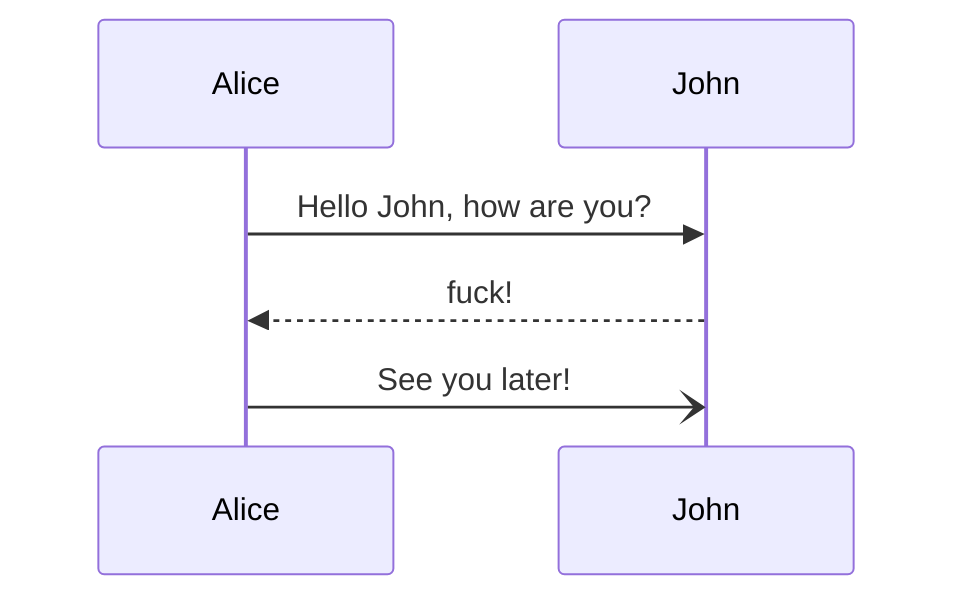

## Hello
world


```python
print("hello, world")
```

```python
import time

print("hello, world!\n")
for i in range(0, 10):
    time.sleep(1)
    print(i, flush=True)
```


```c
#include <stdio.h>

int main() {
    printf("hello!\n");
    return 0;
}
```


```bash
echo "ahhhh" >> somefile
cat somefile
```



```lua
print("hello")

print(string.find("/tmp/XXXXXXXXXXXXXX", "[a-zA-Z]+12[a-zA-Z]+$"))

```

```go
package main

import ("fmt")

func main() {
    fmt.Println("Hey")
}
```

```lua
print("hello")

local str = "python {tmpfile}" 
print(vim.inspect(string.gmatch(str, "{tmpfile}")))

print(type(dsa))
print(os.tmpname())
print(package.config)

local function getTempPath()
    local directorySeperator = package.config:match("([^\n]*)\n?")
    local exampleTempFilePath = os.tmpname()
    
    -- remove generated temp file
    pcall(os.remove, exampleTempFilePath)

    local seperatorIdx = exampleTempFilePath:reverse():find(directorySeperator)
    local tempPathStringLength = #exampleTempFilePath - seperatorIdx

    return exampleTempFilePath:sub(1, tempPathStringLength)
end

print(vim.fs.normalize("./"))

```
